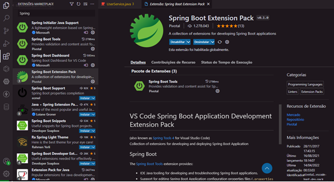
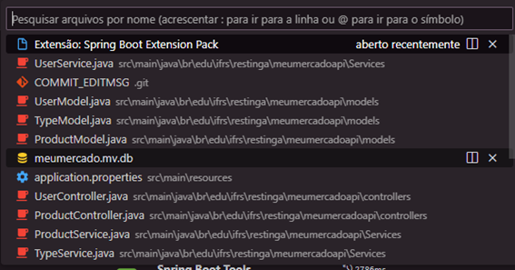
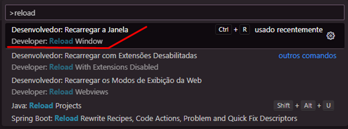
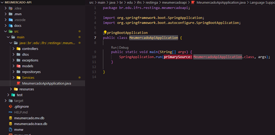
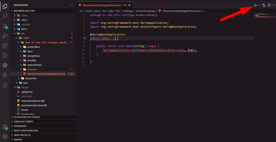
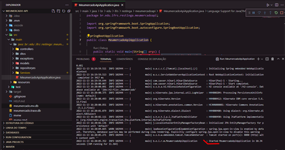
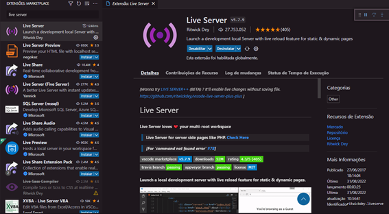
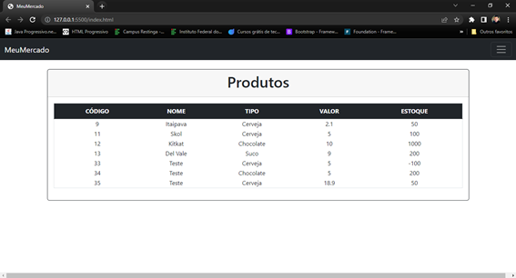

# Teste no Visual Studo Code

## Iniciando o projeto backend
 - Abrir o projeto 'meumercado-api' no Visual Studo Code
 - Baixar a extensão 'Spring Boot Extension Pack' do Visual Studo Code 
    - 
 - Após a instalação dar um Ctrl+p para abrir a pesquisa
    - 
 - Digitar o sinal de maior > e procurar por reload para achar o ‘reload window	
    - 
 - Clicar no ‘Reload Window e esperar o sistema abrir novamente’
 - Acessa o arquivo ‘MeumercadoApiApplication.java’ 
    - 
 - Clicar no botão ‘Run Java’
    - 
 - Esperar o spring iniciar a aplicação
    - 
 - Obs: Deve deixar essa página do Visual Studio Code aberta e rodando

## Iniciando o projeto frontend
 - Abrir o projeto 'meumercado-web' no Visual Studo Code
 - Baixar a extensão ‘Live Server’ do Visual Studo Code 
    - 
 - Após a instalação dar um Ctrl+p para abrir a pesquisa 
    - 
 - Digitar o sinal de maior > e procurar por reload para achar o ‘reload window 
    - 
 - Clicar no ‘Reload Window e esperar o sistema abrir novamente’
 - Após recarregar a página, clicar no botão para iniciar o servidor do ‘Live Server’, assim uma página irá abrir automaticamente no navegador.
    - 